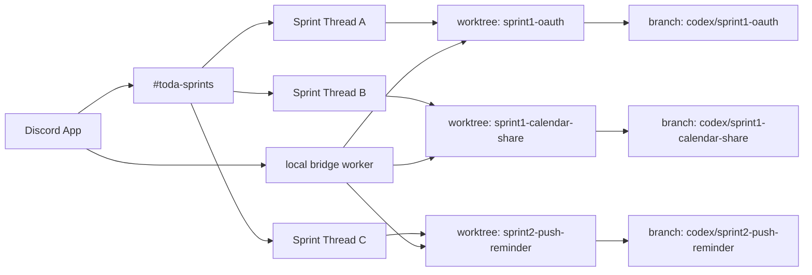

# Discord Remote Sprint Workflow

Discord는 원격 스프린트의 `control plane`, 집 데스크탑은 실제 실행기 역할을 맡는다.

## 목표

- 모바일이나 외부 환경에서도 스프린트를 시작할 수 있어야 한다.
- Discord 앱은 하나만 쓰되, 스프린트는 여러 개를 병렬로 돌릴 수 있어야 한다.
- 사람이 직접 개입하는 지점은 Discovery, Demo 두 게이트로 최소화한다.
- 그 외에는 자연어 대화와 자동 파이프라인으로 흘러가게 한다.

## 핵심 구조

- Discord 앱: 사용자 진입점 하나
- `#toda-sprints`: 스프린트 채널 하나
- Discord thread: 스프린트 하나의 대화 컨텍스트
- worktree: 스프린트 하나의 코드 작업 공간
- branch: 스프린트 하나의 landing 단위
- local bridge worker: Discord 이벤트를 받아 로컬 실행으로 연결하는 백오피스 프로세스
- Codex CLI: thread마다 붙는 persistent session 기반 대화 엔진

## 병렬 스프린트 모델

하나의 Discord 앱으로 여러 스프린트를 동시에 운영한다.

- thread 하나 = sprint 하나
- thread 하나 = Codex session 하나
- sprint 하나 = worktree 하나
- sprint 하나 = branch 하나

예시:

- `sprint1/oauth`
  - thread: Discord 안의 `sprint1-oauth`
  - worktree: `sprint1-oauth`
  - branch: `codex/sprint1-oauth`
- `sprint1/calendar-share`
  - worktree: `sprint1-calendar-share`
  - branch: `codex/sprint1-calendar-share`
- `sprint2/push-reminder`
  - worktree: `sprint2-push-reminder`
  - branch: `codex/sprint2-push-reminder`

이 구조 덕분에 하나의 bot으로도 여러 Codex 실행 컨텍스트를 병렬 관리할 수 있다.

중요한 점은 Discord 스레드가 단순히 최근 메시지를 다시 넣는 프롬프트 박스가 아니라는 점이다.
첫 자연어 질문이 들어오면 thread 전용 Codex session을 만들고,
그다음부터는 같은 session id로 `resume`해서 이어간다.
즉 길게 이어지는 Discovery 논의도 같은 Codex 세션 위에서 계속된다.

같은 스프린트를 다시 시작해야 하면 기존 스레드를 이어갈지, 새 실행으로 열지 고를 수 있다.

- 이어서 가기: 기존 thread/worktree/branch 유지
- 새로 시작하기: 새 thread와 새 worktree/branch 생성
- 새 실행 예시: `sprint1-oauth-2`, `codex/sprint1-oauth-2`

## Discord UX 원칙

사용자 노출 surface는 최대한 단순하게 유지한다.

- slash command:
  - `/sprint`
  - `/status`
- 그 외에는 모두 자연어 대화
- 단계 전환은 버튼만 사용

상세한 대화 톤과 메시지 계약은 [docs/integrations/discord-message-spec.md](/Users/kimyoukwon/Desktop/toda-calendar/docs/integrations/discord-message-spec.md)를 따른다.

즉 사용자는 이런 식으로만 말하면 된다.

- 제품 방향 질문
- 자료 조사 요청
- UX 피드백
- 기술 자문
- 데모 피드백

그리고 게이트를 넘길 때만 버튼을 누른다.

## 대화 모델

스프린트 스레드의 메시지 UX는 두 구간으로 나눈다.

1. 같이 결정하는 구간
- Discovery
- Demo Review

이 구간에서는 bot이:
- 질문에 바로 의견을 준다.
- 추천안을 하나 제시한다.
- 다음으로 좁혀야 할 질문을 남긴다.

2. 내가 알아서 진행하는 구간
- Design Pack
- Demo Build
- Technical Freeze
- Implementation
- Merge

이 구간에서는 bot이:
- 지금 무엇을 하는지 짧게 알려준다.
- 중요한 마일스톤에서만 다시 말한다.
- 불필요한 중간 진행 메시지는 줄인다.

## 수동 게이트

사람이 직접 승인하는 단계는 둘뿐이다.

1. Discovery alignment
2. Demo review

버튼 예시:

- Discovery
  - `다음 단계로 진행`
  - `파기 후 종료`
- Demo
  - `다음 단계로 진행`
  - `파기 후 종료`

자동 진행 단계에서는 `파기 후 종료`만 남긴다.

## 안정성 설계

bridge 계층은 아래를 기본으로 갖춘다.

- slash command는 가능한 한 빨리 `deferReply`로 ack
- background worker는 shell supervisor가 관리
- bridge는 heartbeat 파일을 주기적으로 기록
- 상태 확인은 supervisor pid와 heartbeat를 함께 본다
- `/status`는 thread 안에서는 상세 상태, 채널에서는 전체 스프린트 요약을 보여준다
- 자동 단계는 실제 stage job을 돌리고, job 이력은 `jobs.jsonl`에 남긴다
- 단계가 넘어갈 때는 직전 단계에서 결정된 내용을 handoff summary로 같이 남긴다

## health check 모델

health는 두 겹으로 확인한다.

1. supervisor
  - `toda-discord status`
  - worker가 상주 중인지
2. bridge heartbeat
  - `toda-discord health`
  - 최근 heartbeat가 살아 있는지

## 현재 구현 범위

현재 repo에 구현된 범위는 아래다.

- `/sprint`, `/status`
- thread 단위 sprint state 저장
- worktree / branch 메타데이터 저장
- Discovery 버튼 게이트
- 자연어 메시지 -> `codex exec` 대화 브릿지
- thread별 persistent Codex session 생성 및 resume
- typing / reaction
- shell supervisor 기반 상주 실행
- local health file 기반 상태 점검
- `/design-system` demo surface
- Demo Build 단계에서 `/design-system/examples/<sprint-key>` 데모를 만들도록 하는 stage 계약
- `pnpm preview:demo`로 active sprint branch를 `codex/demo-preview`에 모아 Vercel preview를 만드는 로컬 스크립트

## Demo Build 계약

Demo Build는 단일 화면 시안이 아니라 작은 기능 사용 시나리오를 만든다.

- 전체 demo index: `/design-system`
- 개별 demo route: `/design-system/examples/<sprint-key>`
- demo는 고유 폴더에 둔다.
- demo metadata에는 아래를 포함한다.
  - 기능 진입점
  - 사용자가 기능을 시작하는 trigger
  - 화면 사이 이동
  - 완료 상태
  - 중요한 취소, 빈 상태, fallback 중 최소 하나
  - 사용한 디자인 시스템 컴포넌트와 token
  - review checklist

이 구조는 병렬 스프린트 branch가 서로 다른 demo 폴더만 추가하게 만들어
preview branch에서 merge conflict를 줄인다. 여러 데모를 함께 확인할 때는
`pnpm preview:demo`를 실행해 active sprint branch와 각 worktree의 고유 demo
폴더를 `codex/demo-preview`에 모은 뒤 preview URL을 공유한다.

## 다음 확장 포인트

다음 단계에서 붙일 수 있는 것:

- stage별 전문가 skill 자동 라우팅
- aggregation preview 링크 자동 회신
- merge / deploy 결과 회신
- 오래된 thread 자동 정리 정책
