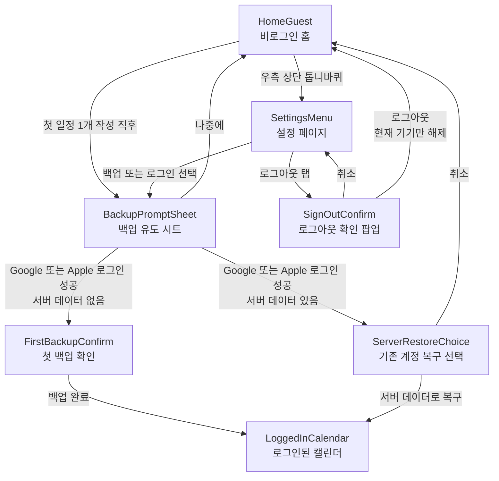

# OAuth Core Flow

`DESIGN_PACK` 단계에서 데모 리뷰 전에 확인할 핵심 흐름만 남긴다.

## Screen Set

- `HomeGuest`
- `BackupPromptSheet`
- `FirstBackupConfirm`
- `ServerRestoreChoice`
- `SettingsMenu`
- `SignOutConfirm`

## Mermaid

## Demo Focus

- 첫 진입은 비로그인 허용인지
- 로그인 유도가 가치 중심 문구로 보이는지
- 첫 백업 경로가 단순한지
- 기존 서버 데이터가 있을 때 서버 우선 원칙이 명확한지
- 설정 진입과 현재 기기 로그아웃 흐름이 자연스러운지
