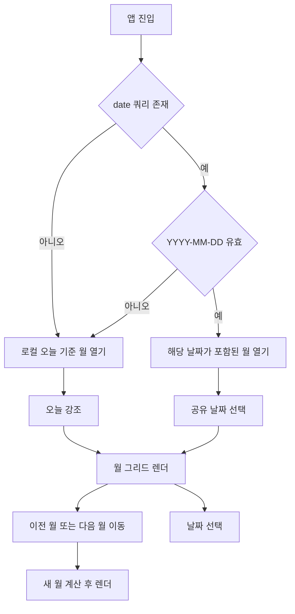

# Calendar Develop Core Flow

```mermaid
flowchart TD
    A[앱 진입] --> B{date 쿼리 존재}
    B -- 아니오 --> C[로컬 오늘 기준 월 열기]
    B -- 예 --> D{YYYY-MM-DD 유효}
    D -- 아니오 --> C
    D -- 예 --> E[해당 날짜가 포함된 월 열기]
    C --> F[오늘 강조]
    E --> G[공유 날짜 선택]
    F --> H[월 그리드 렌더]
    G --> H
    H --> I[이전 월 또는 다음 월 이동]
    I --> J[새 월 계산 후 렌더]
    H --> K[날짜 선택]
```
