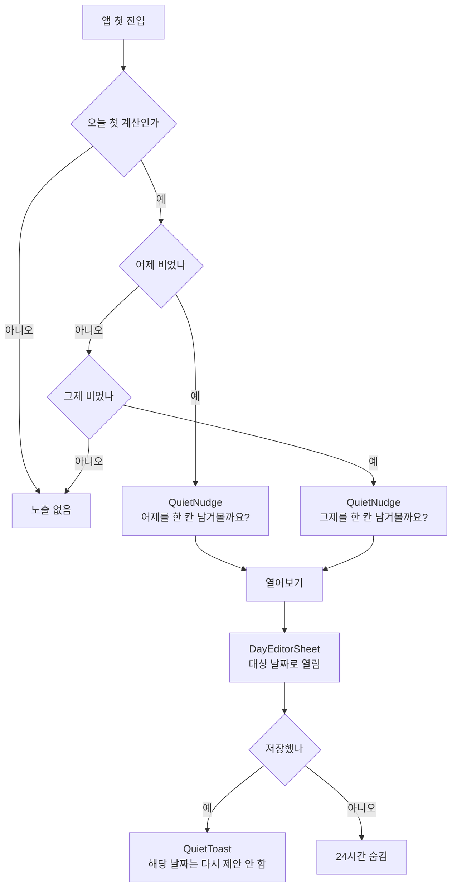

# sprint3-missed-day-recovery core flow

```mermaid
flowchart TD
  A[앱 첫 진입] --> B{오늘 첫 계산인가}
  B -- 아니오 --> Z[노출 없음]
  B -- 예 --> C{어제 비었나}
  C -- 예 --> D[QuietNudge\n어제를 한 칸 남겨볼까요?]
  C -- 아니오 --> E{그제 비었나}
  E -- 예 --> F[QuietNudge\n그제를 한 칸 남겨볼까요?]
  E -- 아니오 --> Z
  D --> G[열어보기]
  F --> G
  G --> H[DayEditorSheet\n대상 날짜로 열림]
  H --> I{저장했나}
  I -- 예 --> J[QuietToast\n해당 날짜는 다시 제안 안 함]
  I -- 아니오 --> K[24시간 숨김]
```

## Notes

- 후보는 하루에 한 번만 계산한다.
- 후보 우선순위는 `어제 -> 그제`다.
- 한 번에 하나의 날짜만 제안한다.
- 셀 표시는 이번 스프린트에서 제외한다.
