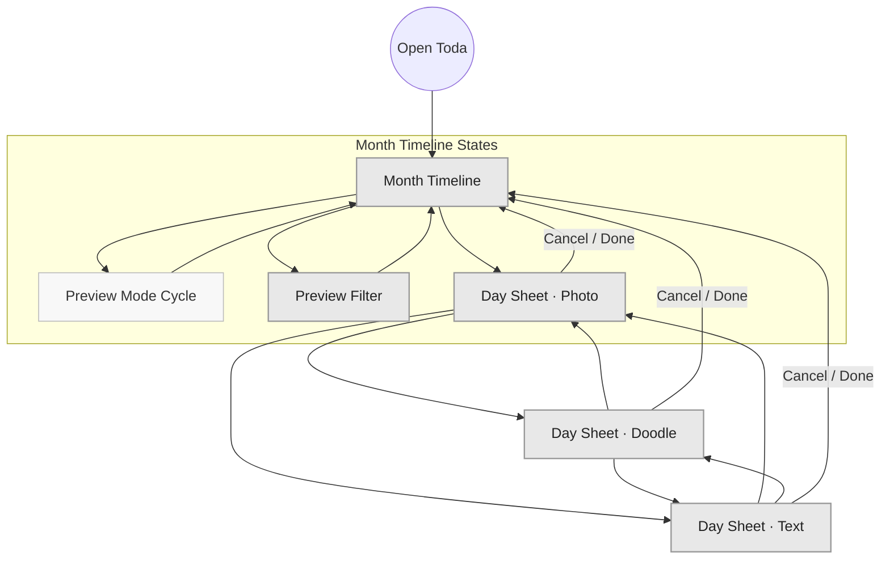

# Screen Map — Toda Calendar Reset

```mermaid
graph TD
    Entry((Open Toda)) --> Month["Month Timeline"]

    subgraph Timeline["Month Timeline States"]
        Month --> PreviewMode["Preview Mode Cycle"]
        Month --> Filter["Preview Filter"]
        Month --> SheetPhoto["Day Sheet · Photo"]
    end

    PreviewMode --> Month
    Filter --> Month

    SheetPhoto --> SheetDoodle["Day Sheet · Doodle"]
    SheetPhoto --> SheetText["Day Sheet · Text"]
    SheetDoodle --> SheetPhoto
    SheetDoodle --> SheetText
    SheetText --> SheetPhoto
    SheetText --> SheetDoodle

    SheetPhoto -->|Cancel / Done| Month
    SheetDoodle -->|Cancel / Done| Month
    SheetText -->|Cancel / Done| Month

    classDef screen fill:#e8e8e8,stroke:#999,stroke-width:1.5px,color:#222;
    classDef state fill:#f8f8f8,stroke:#bbb,stroke-width:1px,color:#333;
    class Month,Filter,SheetPhoto,SheetDoodle,SheetText screen
    class PreviewMode state
```
