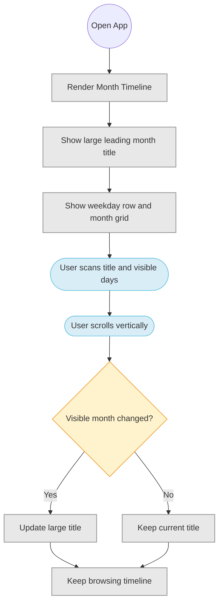

# UC-001 Flow — Orient Within the Month Timeline

```mermaid
graph TD
    A((Open App)) --> B["Render Month Timeline"]
    B --> C["Show large leading month title"]
    C --> D["Show weekday row and month grid"]
    D --> E([User scans title and visible days])
    E --> F([User scrolls vertically])
    F --> G{"Visible month changed?"}
    G -- "Yes" --> H["Update large title"]
    G -- "No" --> I["Keep current title"]
    H --> J["Keep browsing timeline"]
    I --> J

    classDef screen fill:#e8e8e8,stroke:#999,stroke-width:1.5px;
    classDef decision fill:#fff3cd,stroke:#f0ad4e,stroke-width:1.5px;
    classDef action fill:#d9edf7,stroke:#5bc0de,stroke-width:1px;
    class B,C,D,H,I,J screen
    class G decision
    class E,F action
```
