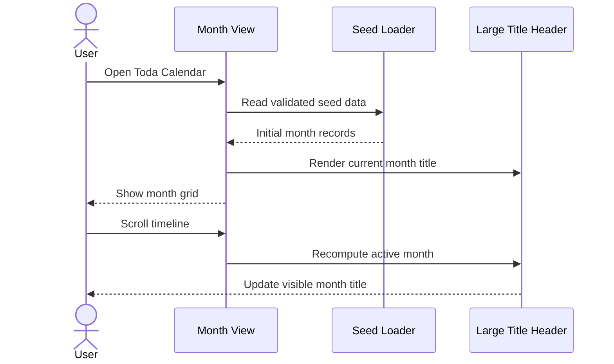

# UC-001 Sequence — Orient Within the Month Timeline

```mermaid
sequenceDiagram
    actor User
    participant App as Month View
    participant Seed as Seed Loader
    participant Header as Large Title Header

    User->>App: Open Toda Calendar
    App->>Seed: Read validated seed data
    Seed-->>App: Initial month records
    App->>Header: Render current month title
    App-->>User: Show month grid
    User->>App: Scroll timeline
    App->>Header: Recompute active month
    Header-->>User: Update visible month title
```
