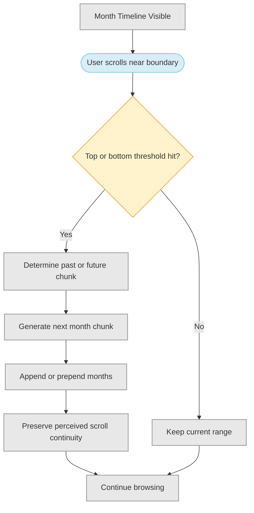

# UC-002 Flow — Browse Earlier and Later Months Continuously

```mermaid
graph TD
    A["Month Timeline Visible"] --> B([User scrolls near boundary])
    B --> C{"Top or bottom threshold hit?"}
    C -- "No" --> D["Keep current range"]
    C -- "Yes" --> E["Determine past or future chunk"]
    E --> F["Generate next month chunk"]
    F --> G["Append or prepend months"]
    G --> H["Preserve perceived scroll continuity"]
    H --> I["Continue browsing"]
    D --> I

    classDef screen fill:#e8e8e8,stroke:#999,stroke-width:1.5px;
    classDef decision fill:#fff3cd,stroke:#f0ad4e,stroke-width:1.5px;
    classDef action fill:#d9edf7,stroke:#5bc0de,stroke-width:1px;
    class A,D,E,F,G,H,I screen
    class C decision
    class B action
```
