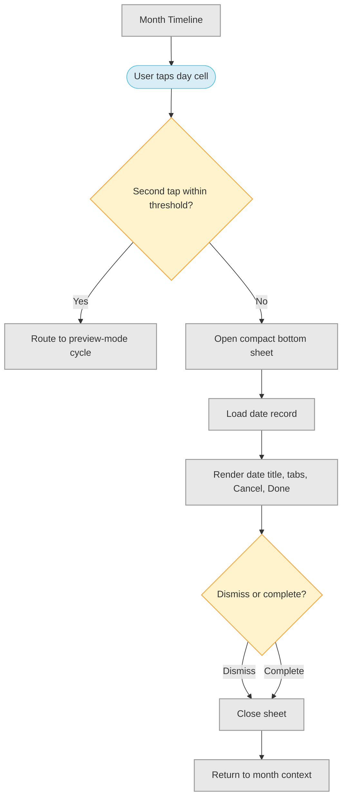

# UC-003 Flow — Open the Compact Day Sheet

```mermaid
graph TD
    A["Month Timeline"] --> B([User taps day cell])
    B --> C{"Second tap within threshold?"}
    C -- "Yes" --> D["Route to preview-mode cycle"]
    C -- "No" --> E["Open compact bottom sheet"]
    E --> F["Load date record"]
    F --> G["Render date title, tabs, Cancel, Done"]
    G --> H{"Dismiss or complete?"}
    H -- "Dismiss" --> I["Close sheet"]
    H -- "Complete" --> I
    I --> J["Return to month context"]

    classDef screen fill:#e8e8e8,stroke:#999,stroke-width:1.5px;
    classDef decision fill:#fff3cd,stroke:#f0ad4e,stroke-width:1.5px;
    classDef action fill:#d9edf7,stroke:#5bc0de,stroke-width:1px;
    class A,D,E,F,G,I,J screen
    class C,H decision
    class B action
```
