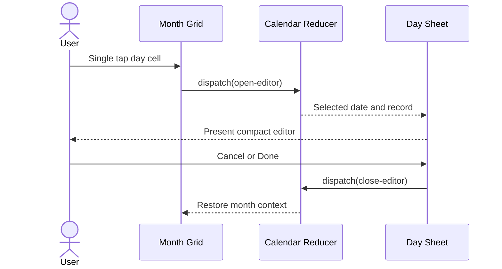

# UC-003 Sequence — Open the Compact Day Sheet

```mermaid
sequenceDiagram
    actor User
    participant Grid as Month Grid
    participant Reducer as Calendar Reducer
    participant Sheet as Day Sheet

    User->>Grid: Single tap day cell
    Grid->>Reducer: dispatch(open-editor)
    Reducer-->>Sheet: Selected date and record
    Sheet-->>User: Present compact editor
    User->>Sheet: Cancel or Done
    Sheet->>Reducer: dispatch(close-editor)
    Reducer-->>Grid: Restore month context
```
