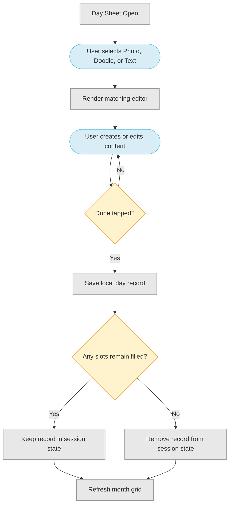

# UC-004 Flow — Edit Day Content

```mermaid
graph TD
    A["Day Sheet Open"] --> B([User selects Photo, Doodle, or Text])
    B --> C["Render matching editor"]
    C --> D([User creates or edits content])
    D --> E{"Done tapped?"}
    E -- "No" --> D
    E -- "Yes" --> F["Save local day record"]
    F --> G{"Any slots remain filled?"}
    G -- "Yes" --> H["Keep record in session state"]
    G -- "No" --> I["Remove record from session state"]
    H --> J["Refresh month grid"]
    I --> J

    classDef screen fill:#e8e8e8,stroke:#999,stroke-width:1.5px;
    classDef decision fill:#fff3cd,stroke:#f0ad4e,stroke-width:1.5px;
    classDef action fill:#d9edf7,stroke:#5bc0de,stroke-width:1px;
    class A,C,F,H,I,J screen
    class E,G decision
    class B,D action
```
