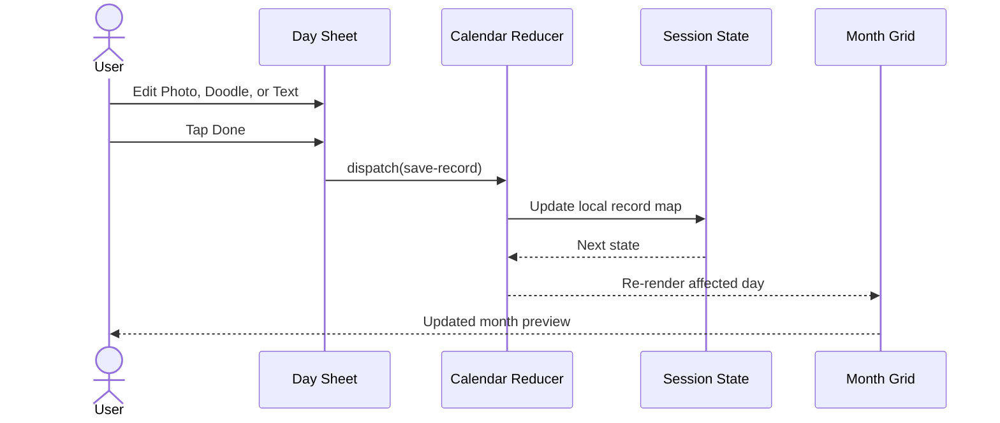

# UC-004 Sequence — Edit Day Content

```mermaid
sequenceDiagram
    actor User
    participant Sheet as Day Sheet
    participant Reducer as Calendar Reducer
    participant Session as Session State
    participant Grid as Month Grid

    User->>Sheet: Edit Photo, Doodle, or Text
    User->>Sheet: Tap Done
    Sheet->>Reducer: dispatch(save-record)
    Reducer->>Session: Update local record map
    Session-->>Reducer: Next state
    Reducer-->>Grid: Re-render affected day
    Grid-->>User: Updated month preview
```
