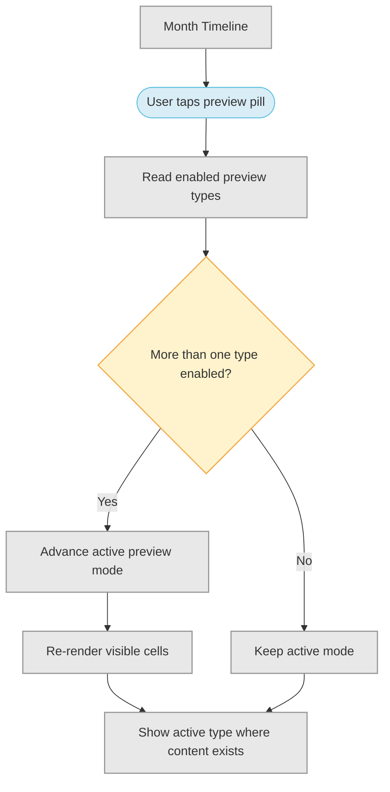

# UC-005 Flow — Change the Global Visible Preview Mode

```mermaid
graph TD
    A["Month Timeline"] --> B([User taps preview pill])
    B --> C["Read enabled preview types"]
    C --> D{"More than one type enabled?"}
    D -- "No" --> E["Keep active mode"]
    D -- "Yes" --> F["Advance active preview mode"]
    F --> G["Re-render visible cells"]
    G --> H["Show active type where content exists"]
    E --> H

    classDef screen fill:#e8e8e8,stroke:#999,stroke-width:1.5px;
    classDef decision fill:#fff3cd,stroke:#f0ad4e,stroke-width:1.5px;
    classDef action fill:#d9edf7,stroke:#5bc0de,stroke-width:1px;
    class A,C,E,F,G,H screen
    class D decision
    class B action
```
