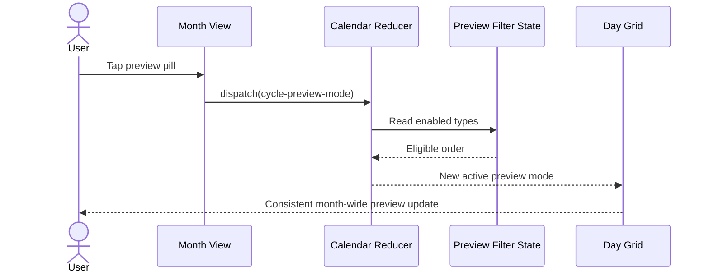

# UC-005 Sequence — Change the Global Visible Preview Mode

```mermaid
sequenceDiagram
    actor User
    participant View as Month View
    participant Reducer as Calendar Reducer
    participant Filter as Preview Filter State
    participant Grid as Day Grid

    User->>View: Tap preview pill
    View->>Reducer: dispatch(cycle-preview-mode)
    Reducer->>Filter: Read enabled types
    Filter-->>Reducer: Eligible order
    Reducer-->>Grid: New active preview mode
    Grid-->>User: Consistent month-wide preview update
```
