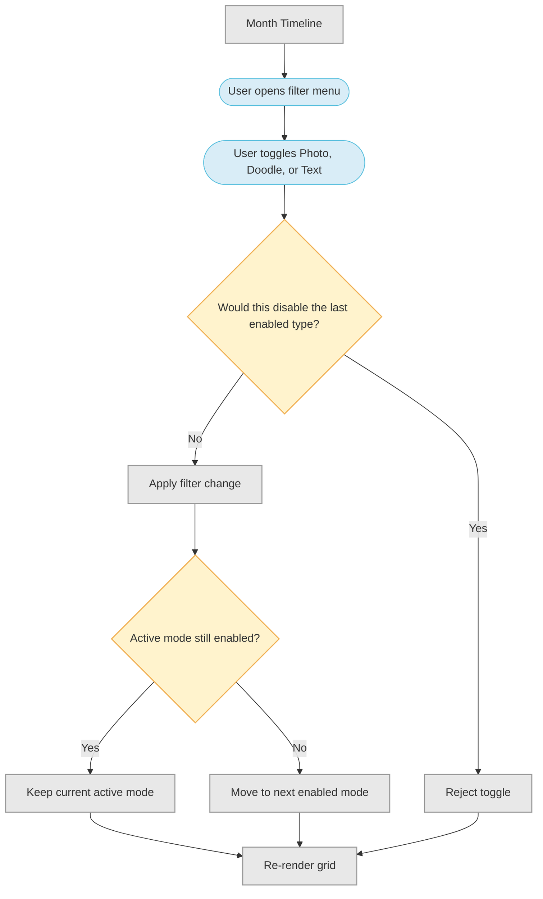

# UC-006 Flow — Configure the Preview Cycle Filter

```mermaid
graph TD
    A["Month Timeline"] --> B([User opens filter menu])
    B --> C([User toggles Photo, Doodle, or Text])
    C --> D{"Would this disable the last enabled type?"}
    D -- "Yes" --> E["Reject toggle"]
    D -- "No" --> F["Apply filter change"]
    F --> G{"Active mode still enabled?"}
    G -- "Yes" --> H["Keep current active mode"]
    G -- "No" --> I["Move to next enabled mode"]
    H --> J["Re-render grid"]
    I --> J
    E --> J

    classDef screen fill:#e8e8e8,stroke:#999,stroke-width:1.5px;
    classDef decision fill:#fff3cd,stroke:#f0ad4e,stroke-width:1.5px;
    classDef action fill:#d9edf7,stroke:#5bc0de,stroke-width:1px;
    class A,E,F,H,I,J screen
    class D,G decision
    class B,C action
```
