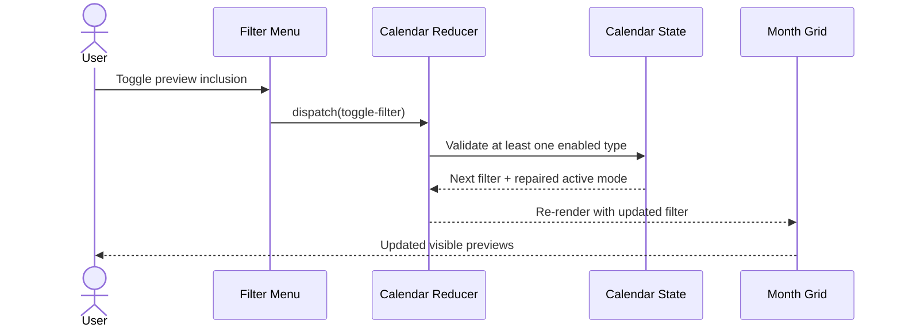

# UC-006 Sequence — Configure the Preview Cycle Filter

```mermaid
sequenceDiagram
    actor User
    participant Menu as Filter Menu
    participant Reducer as Calendar Reducer
    participant State as Calendar State
    participant Grid as Month Grid

    User->>Menu: Toggle preview inclusion
    Menu->>Reducer: dispatch(toggle-filter)
    Reducer->>State: Validate at least one enabled type
    State-->>Reducer: Next filter + repaired active mode
    Reducer-->>Grid: Re-render with updated filter
    Grid-->>User: Updated visible previews
```
