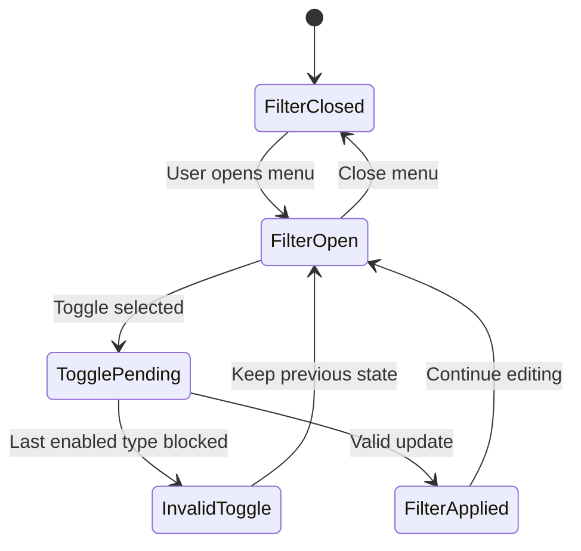

# UC-006 States — Configure the Preview Cycle Filter

```mermaid
stateDiagram-v2
    [*] --> FilterClosed
    FilterClosed --> FilterOpen: User opens menu
    FilterOpen --> TogglePending: Toggle selected
    TogglePending --> InvalidToggle: Last enabled type blocked
    TogglePending --> FilterApplied: Valid update
    InvalidToggle --> FilterOpen: Keep previous state
    FilterApplied --> FilterOpen: Continue editing
    FilterOpen --> FilterClosed: Close menu
```
