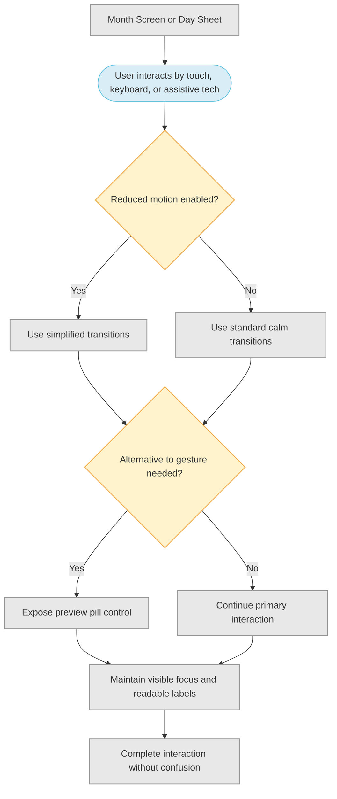

# UC-007 Flow — Preserve Calm Accessibility

```mermaid
graph TD
    A["Month Screen or Day Sheet"] --> B([User interacts by touch, keyboard, or assistive tech])
    B --> C{"Reduced motion enabled?"}
    C -- "Yes" --> D["Use simplified transitions"]
    C -- "No" --> E["Use standard calm transitions"]
    D --> F{"Alternative to gesture needed?"}
    E --> F
    F -- "Yes" --> G["Expose preview pill control"]
    F -- "No" --> H["Continue primary interaction"]
    G --> I["Maintain visible focus and readable labels"]
    H --> I
    I --> J["Complete interaction without confusion"]

    classDef screen fill:#e8e8e8,stroke:#999,stroke-width:1.5px;
    classDef decision fill:#fff3cd,stroke:#f0ad4e,stroke-width:1.5px;
    classDef action fill:#d9edf7,stroke:#5bc0de,stroke-width:1px;
    class A,D,E,G,H,I,J screen
    class C,F decision
    class B action
```
