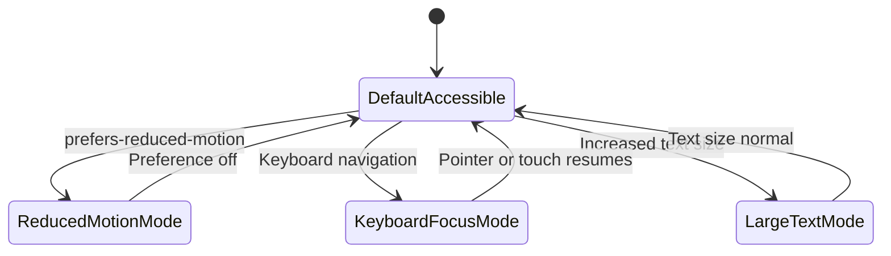

# UC-007 States — Preserve Calm Accessibility

```mermaid
stateDiagram-v2
    [*] --> DefaultAccessible
    DefaultAccessible --> ReducedMotionMode: prefers-reduced-motion
    DefaultAccessible --> KeyboardFocusMode: Keyboard navigation
    DefaultAccessible --> LargeTextMode: Increased text size
    ReducedMotionMode --> DefaultAccessible: Preference off
    KeyboardFocusMode --> DefaultAccessible: Pointer or touch resumes
    LargeTextMode --> DefaultAccessible: Text size normal
```
